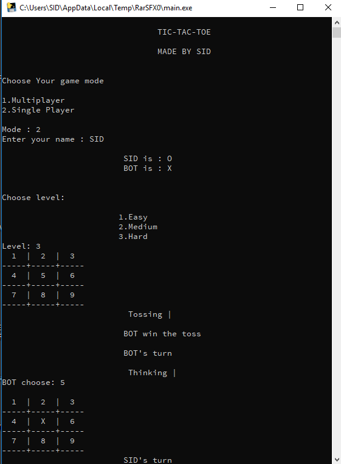

# TIC-TAC-TOE
Making my own TIC-TAC-TOE artificial intelligence.

# How to Run the game?
To Run the game first be sure all the file of the project in the same folder and then run main.py file with Python3 or you can just run the binary version, which is located in the dist folder.

